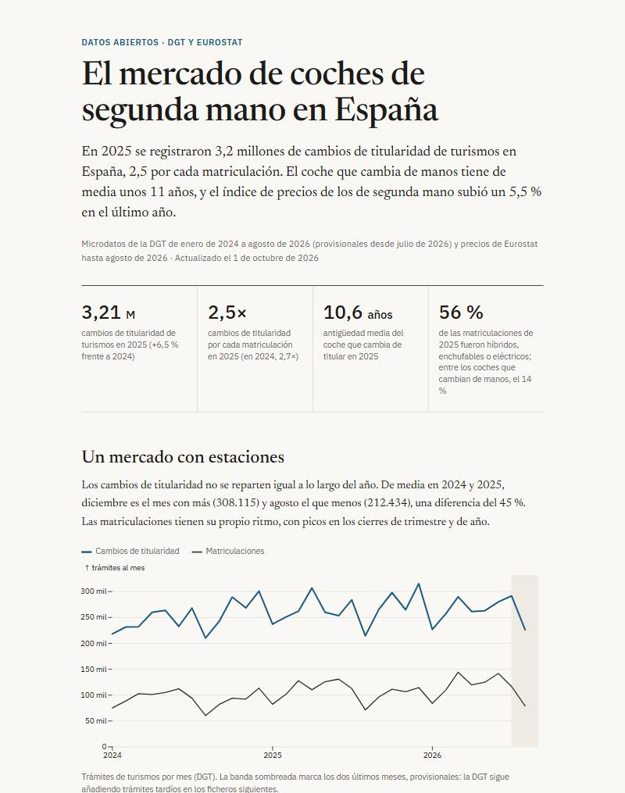
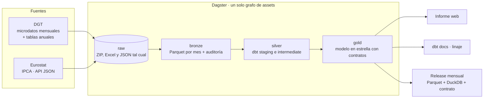

# El mercado de coches de segunda mano en España

[](https://github.com/marnau74/coches-usados-espana/actions/workflows/ci.yml)
[](https://github.com/marnau74/coches-usados-espana/actions/workflows/publicar.yml)
[](LICENSE)

Plataforma de datos abiertos sobre matriculaciones, cambios de titularidad y bajas de
turismos en España. Descarga cada mes los microdatos de la DGT (23 millones de trámites) y el
índice de precios de Eurostat, los organiza por capas en un warehouse, los transforma con dbt,
**cuadra los microdatos con las tablas oficiales de la propia DGT** y publica, sin intervención
manual, un informe web, la documentación con el linaje y los datos.

**[Ver el informe →](https://marnau74.github.io/coches-usados-espana/)** ·
[Documentación y linaje de los datos](https://marnau74.github.io/coches-usados-espana/docs/) ·
[Descargar los datos](https://github.com/marnau74/coches-usados-espana/releases)

[](https://marnau74.github.io/coches-usados-espana/)

## La pregunta

¿Cuánto se mueve el mercado de coches de segunda mano en España, cómo es el coche que cambia
de manos y qué relación tiene con el de nuevo, con el combustible y con los precios?

## Resultados

Con datos hasta agosto de 2026 (las cifras al día están en el informe, que las recalcula en
cada ejecución):

- **3,2 millones de cambios de titularidad de turismos en 2025**, un 6,5 % más que en 2024:
  2,5 por cada matriculación (2,7 en 2024).
- **El coche que cambia de manos tiene de media 10,6 años**; el 47 % tiene diez o más y el
  22 % menos de tres.
- **El mercado de ocasión va años por detrás del nuevo.** El diésel fue el 47 % de los cambios
  de titularidad de 2025 y solo el 11 % de las matriculaciones; los híbridos, enchufables y
  eléctricos, el 14 % y el 56 %.
- **Diciembre es el mes con más cambios de titularidad y agosto el que menos** (308.000 y
  212.000 de media en 2024 y 2025, un 45 % de diferencia).
- **Precios:** el índice de Eurostat de coches de segunda mano subió un 5,5 % en el último año
  (nuevos, +0,6 %; todos los precios, +4,6 %). Es un índice, no un precio en euros: [por qué](docs/adr/0006-precios-solo-como-indice.md).
- **Bajas:** febrero de 2024 tiene 520.000 bajas de turismos por «otros motivos», concentradas
  en tres días; un mes normal tiene unas 400 por ese motivo. La fuente no lo explica y su tabla
  oficial lo recoge.

## Arquitectura



| Capa | Dónde | Contenido |
|---|---|---|
| raw | `data/raw/<fuente>/` | Lo descargado, tal cual; inmutable |
| bronze | `data/bronze/` y DuckDB (`bronze`) | Un Parquet por mes y trámite con los 69 campos como texto recortado, `_fichero_origen` y `_linea` |
| silver | dbt (`staging`, `intermediate`) | Tipado y reglas de negocio: qué trámites cuentan, combustible, antigüedad, marca y modelo |
| gold | dbt (`marts`) | Modelo en estrella con contratos: lo único que se consume |

GitHub Actions ejecuta la calidad en cada cambio (`ci.yml`, con datos sintéticos de formato
idéntico al real) y, el día 20 de cada mes, el pipeline completo con datos reales y la
publicación (`publicar.yml`).

**Sobre la escala:** son 23 millones de filas de microdatos y unos 2 GB de ficheros. DuckDB
construye todo el modelo y pasa las 100 comprobaciones en unos 20 segundos.

## Calidad de los datos

Una fuente de ancho fijo y sin cabecera se puede leer mal sin que nada falle, así que el
proyecto lo comprueba por varios caminos ([ADR 0005](docs/adr/0005-cuadre-con-las-tablas-oficiales.md)):

- **Cuadre con las tablas oficiales de la DGT.** Los microdatos se comparan mes a mes con las
  tablas estadísticas que publica la propia DGT. En los 24 meses de 2024 y 2025, los cambios de
  titularidad de turismos coinciden con una diferencia **máxima del 0,13 %** (media 0,06 %); las
  bajas definitivas, con un 0,2 % salvo tres meses, que están documentados como excepción.
- **Formato.** Todas las líneas deben medir 714 caracteres, o el fichero se rechaza. Cada ZIP se
  valida antes de aceptarlo ([ADR 0007](docs/adr/0007-formato-de-los-ficheros-de-la-dgt.md)).
- **Completitud.** Un fichero por cada mes y tipo de trámite; todas las fechas válidas.
- **Coherencia entre publicaciones de la DGT.** La serie histórica y las tablas mensuales dan
  los mismos totales; la variación de precios de Eurostat coincide con la de su propio índice.
- **Los tests fallan cuando deben.** Los de cuadre tienen su propio test: se manipula una cifra
  de la tabla oficial y se comprueba que el test falla.

100 comprobaciones de dbt y 95 tests de Python.

## Lo que este proyecto corrige de lecturas ingenuas de la misma fuente

[ADR 0004](docs/adr/0004-semantica-de-los-datos.md) y [0007](docs/adr/0007-formato-de-los-ficheros-de-la-dgt.md)
explican con cifras:

- Leer el fichero como UTF-8 con `ignore_errors` pierde en silencio el 5 % de las filas (las
  de los municipios con eñe o tildes).
- Los ficheros mezclan motos, furgonetas, camiones y remolques: «turismo» es el tipo 40.
- Un trámite pertenece al mes de su **fecha de trámite**, no al del fichero: el de junio de 2025
  trae 65.669 turismos de abril.
- Las bajas incluyen las temporales (que no sacan el coche del parque) y depuraciones masivas.
- Una cifra es un trámite, no un coche ni una venta.

## Modelo de datos

| Hecho ↓ / Dimensión → | fecha | provincia | combustible |
|---|:-:|:-:|:-:|
| `fct_tramites_mensual` (matriculaciones, cambios de titularidad y bajas; antigüedad, tipo de titular, procedencia y motivo de baja) | ✓ | ✓ | ✓ |
| `fct_modelos_mensual` (por marca y modelo) | ✓ | | |
| `fct_precios_indice_mensual` (Eurostat) | ✓ | | |
| `fct_titularidad_anual` (serie histórica desde 1990) | | | |

## Datos publicados

Cada mes se publica una *release* `datos-AAAA-MM` con la capa gold:

| Fichero | Para qué |
|---|---|
| `*.parquet` | Una tabla por fichero: pandas, Power BI, Spark… |
| `coches_usados.duckdb` | Todas las tablas en un fichero (esquema `gold`) |
| `contrato.json` | Versión del contrato, tablas, columnas, tipos y filas |
| `SHA256SUMS` | Comprobación de la descarga (`sha256sum -c SHA256SUMS`) |

```python
import duckdb

duckdb.sql("SELECT * FROM 'fct_tramites_mensual.parquet' LIMIT 5")
```

## Fuentes

- **Dirección General de Tráfico**, [microdatos mensuales](https://datos.gob.es/es/catalogo/e00003801-microdatos-de-transferencias-de-vehiculos-mensual)
  de matriculaciones, transferencias y bajas (licencia CC BY 4.0), y sus tablas estadísticas
  anuales. Desde febrero de 2025 los ficheros ya no traen el bastidor completo.
- **Eurostat**, índice de precios de consumo armonizado (`prc_hicp_minr`, ECOICOP 2): automóviles
  de segunda mano (07.1.1.2), nuevos (07.1.1.1) y total, para España y la zona euro.

## Cómo ejecutarlo

Requiere [uv](https://docs.astral.sh/uv/) (instala Python 3.12 o 3.13 si hace falta). La primera
ejecución descarga unos 2 GB de la DGT y tarda unos 15 minutos; las siguientes solo piden los meses nuevos.

```bash
uv sync                                                  # entorno y dependencias exactas
uv run dagster job execute -m coches_usados.definitions -j pipeline_mensual   # todo el pipeline
uv run python -m coches_usados.report.build_site         # informe en site/index.html
uv run python -m coches_usados.release                   # paquete de datos en release/
```

Con `uv run dagster dev` se abre la interfaz de Dagster (http://localhost:3000) con el grafo
completo. Cada paso se puede lanzar por separado:

```bash
uv run python -m coches_usados.bronze                    # raw a Parquet y DuckDB
uv run dbt build --project-dir dbt --profiles-dir dbt    # silver y gold: modelos y tests
```

Calidad: `uv run pytest`, y `uv run pre-commit install` activa las mismas comprobaciones que
la CI (ruff, sqlfluff y un control que impide subir rutas locales o correos personales).
Para probar dbt sin descargar nada: `uv run python scripts/warehouse_de_prueba.py data/warehouse_ci.duckdb`
construye un warehouse con datos sintéticos de formato idéntico al real.

## Estructura

```
src/coches_usados/
  ingest/        clientes de las fuentes y diseño de registro de la DGT
  bronze.py      raw a Parquet y DuckDB
  definitions.py grafo de Dagster: assets, comprobaciones y programación
  report/        indicadores (SQL sobre gold) y plantilla de la web
  release.py     paquete de datos para las releases
dbt/
  models/        staging, intermediate y marts
  seeds/         series de Eurostat, provincias, tipos de vehículo y excepciones documentadas
  tests/         tests singulares (cuadre con la DGT, completitud...) y genéricos propios
datos_de_referencia/  tablas estadísticas anuales de la DGT (oficiales, sin modificar)
tests/           pytest, con datos sintéticos del mismo formato que las fuentes
```

## Límites conocidos

- Son **trámites, no ventas**: una compraventa con concesionario cuenta dos veces y un cambio de
  titularidad puede ser una herencia. No hay datos de precios en euros: ninguna fuente oficial y
  abierta los publica ([ADR 0006](docs/adr/0006-precios-solo-como-indice.md)).
- Los dos últimos meses son provisionales (la DGT sigue añadiendo trámites tardíos).
- Las **matriculaciones no se cuadran** con una tabla oficial: no se ha localizado la que
  publica la DGT. Las transferencias y las bajas sí.
- El cuadre solo cubre los meses con tabla publicada (hasta diciembre de 2025).
- El modelo se agrupa por familia con reglas sencillas: algunas denominaciones comerciales se
  reparten en dos nombres en el registro.
- Los recuentos por provincia no se ponderan por población (no hay un padrón en el proyecto).
- El servidor de la DGT falla a ratos con las tablas anuales (errores 500, y a un fichero que no
  existe responde con una redirección a un servidor con certificado inválido, no con un 404).
  Por eso las ya publicadas están guardadas en [`datos_de_referencia/`](datos_de_referencia/README.md)
  y solo se descargan las de años nuevos. Los microdatos sí se descargan sin problemas, también
  desde GitHub Actions.

## Licencia

Código bajo licencia [MIT](LICENSE). Los datos pertenecen a sus autores (DGT bajo CC BY 4.0;
Eurostat con cita de la fuente); el proyecto publica datos derivados con la atribución
correspondiente.
